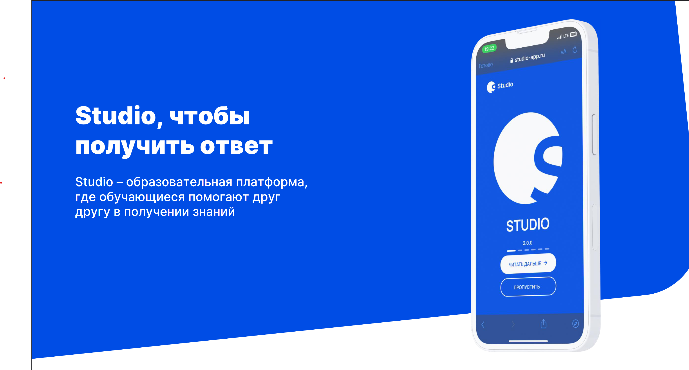

Education:
- ITMO University - Sofware Engineering

Skills:
- Frameworks: ASP.NET, Spring, React
- Microservice architecture
- RESTful APIs, gRPC
- Programming Languages: C#, Java, Kotlin, TypeScript, Rust, Python
- SQL and NOSQL
- OOP Patterns
- Docker

Projects:
1. **ASP.NET**: IS-OOP-26
   - Lab5 - A web-based banking application **ASP.NET** microservices with **gRPC** and **distributed transactions**
   - Lab1 - Lab4 using OOP Patterns with C#
   - Repository: [IS-OOP-26](https://github.com/XPlaGo/Itmo.ObjectOrientedProgramming)
2. **Cat Sharing**:
   - Creation and exchange of virtual cats for in-app currency, **distributed transactions** based on **Kafka Streams**.
   

      
      
      
      
   

   - Microservices: [https://github.com/XPlaGo/cat-sharing-services](https://github.com/XPlaGo/cat-sharing-services) - Spring Boot
   - Mobile Application: [https://github.com/XPlaGo/cat_sharing_client_app](https://github.com/XPlaGo/cat_sharing_client_app) - Flutter
4. **XMess**
   - [About project](https://xmess-about.framer.website)
   - A messenger based on a microservice architecture with voice control capability.
   - Technologies used: Spring (Java/Kotlin), React+Redux+TypeScript
   - 
   - XMess React client: [https://github.com/XPlaGo/xmess-client](https://github.com/XPlaGo/xmess-client)
   - XMess auth service with Kotlin: [https://github.com/XPlaGo/XMessAuthServiceKotlin](https://github.com/XPlaGo/XMessAuthServiceKotlin)
   - XMess messaging service: [https://github.com/XPlaGo/XMessMessagingService](https://github.com/XPlaGo/XMessMessagingService)
   - XMess naming service: [https://github.com/XPlaGo/https://github.com/XPlaGo/XMessNamingService](https://github.com/XPlaGo/XMessNamingService)
   - XMess auth balancer service: [https://github.com/XPlaGo/XMessAuthBalancer](https://github.com/XPlaGo/XMessAuthBalancer)
   - XMess client provider service: [https://github.com/XPlaGo/XMessClientProvider](https://github.com/XPlaGo/https://github.com/XPlaGo/XMessClientProvider)
   - XMess gateway service: [https://github.com/XPlaGo/XMessGateway](https://github.com/XPlaGo/XMessGateway)
   - XMess config service: [https://github.com/XPlaGo/XMessConfigServer](https://github.com/XPlaGo/XMessConfigServer)
5. **Studio**
    - [Download app for Android in Rustore](https://apps.rustore.ru/app/com.xplago.studio)
    - Hi! The Studio educational multi-platform team is in touch: Grigory Nersesyan (project manager and interface designer) and Nikita Zaguta (fullstack developer). The goal of our project is to improve the academic performance of students in grades 8-11 and students in 1-2 courses. And how are we going to do that? Download the app soon and find out! The project is being implemented within the framework of the All-Russian competition "Твой Ход". Project ID: 4700.
   - 
